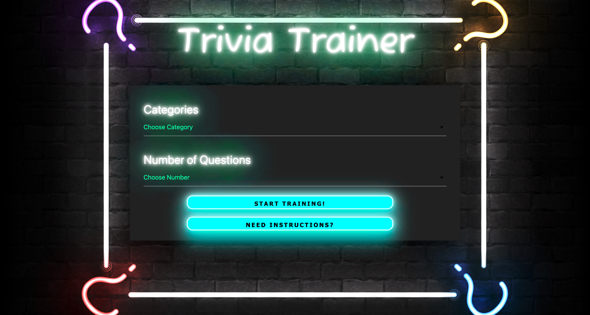

# Trivia Trainer 

## Description

Trivia Trainer is an application that generates randomized trivia questions for the user based on their selections. The user has a choice of the number of trivia questions, category types, or even to randomly generate questions from every category. Trivia Trainer can be used as a way to practice for formal trivia nights, or as a game. 

## Deployed Application
https://cjpritch.github.io/trivia-trainer/